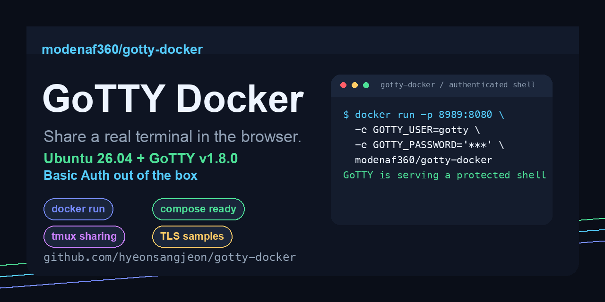
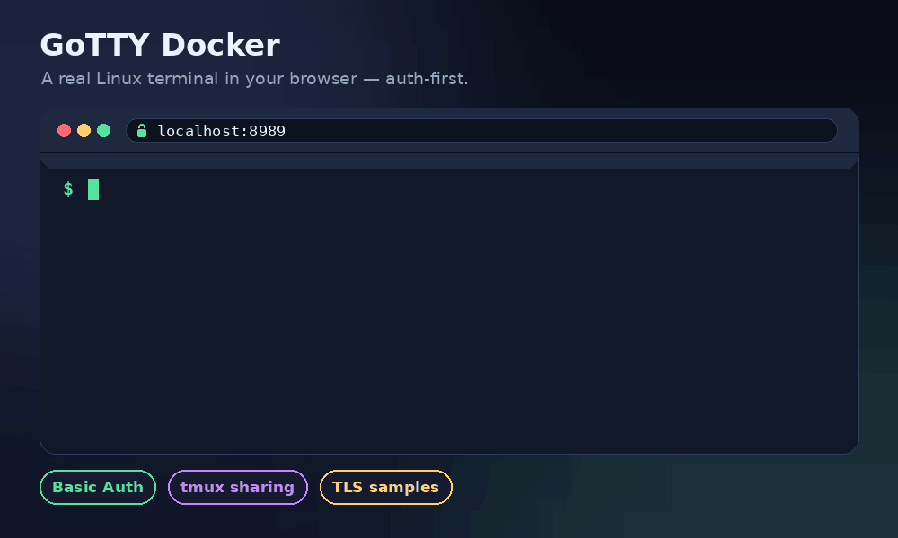

# GoTTY Docker

[](https://github.com/hyeonsangjeon/gotty-docker/actions/workflows/ci.yml)
[](https://github.com/hyeonsangjeon/gotty-docker/actions/workflows/docker-publish.yml)
[](https://hub.docker.com/r/modenaf360/gotty-docker)
[](https://hub.docker.com/r/modenaf360/gotty-docker)
[](https://github.com/sorenisanerd/gotty/releases/tag/v1.8.0)
[](https://hub.docker.com/_/ubuntu)
[](https://hub.docker.com/r/modenaf360/gotty-docker/tags)
[](LICENSE)
[](CONTRIBUTING.md)
[](https://github.com/hyeonsangjeon/gotty-docker/stargazers)



Run a real Linux terminal in your browser with Docker. This repo revives the old GoTTY Docker image with a modern base image, a maintained GoTTY fork, Basic Auth helpers, Compose examples, and multi-architecture publishing.



## Contents

- [Why](#why)
- [Features](#features)
- [What's New](#whats-new)
- [Quick Start](#quick-start)
- [Common Samples](#common-samples)
- [Behind a Reverse Proxy](#behind-a-reverse-proxy)
- [Configuration](#configuration)
- [Image Tags](#image-tags)
- [Security Notes](#security-notes)
- [Build](#build)
- [Publish](#publish)
- [Troubleshooting](#troubleshooting)
- [Assets](#assets)
- [Contributing](#contributing)
- [References](#references)

## Why

[GoTTY](https://github.com/sorenisanerd/gotty) turns any command-line program into
a web application, which is perfect for sharing a shell, a live log, or a TUI
dashboard without installing anything on the client. This image gives you a
batteries-included, authentication-first container so you can go from
`docker run` to a usable browser terminal in one command — instead of wiring up
GoTTY, a base image, TLS, and auth yourself every time.

## Features

- 🔐 **Auth-first** — Basic Auth via env vars, a credential string, or Docker secret files; warns loudly if you start without it.
- 🧱 **Modern base** — Ubuntu 26.04 + the maintained `sorenisanerd/gotty v1.8.0`, with the release tarball checksum-verified at build time.
- 🏗️ **Multi-arch** — published for `linux/amd64` and `linux/arm64`.
- 🩺 **Healthcheck built in** — the container reports healthy on `200`/`401`.
- 📦 **Compose-ready** — five runnable examples covering the common GoTTY patterns.
- 🛠️ **Configurable** — sensible defaults you can override entirely through `GOTTY_*` environment variables.

## What's New

- Ubuntu base upgraded from `14.04` to `26.04`.
- GoTTY upgraded from the original `yudai/gotty v1.0.1` release to the maintained `sorenisanerd/gotty v1.8.0`.
- `linux/amd64` and `linux/arm64` image publishing support.
- Basic Auth can be configured with `GOTTY_USER` + `GOTTY_PASSWORD`, `GOTTY_CREDENTIAL`, or Docker secret files.
- Runnable examples for the common GoTTY patterns: authenticated shell, read-only monitor, shared `tmux`, random URL, and TLS.

## Quick Start

```console
export GOTTY_PASSWORD="$(openssl rand -base64 24)"
echo "GoTTY password: ${GOTTY_PASSWORD}"

docker run --rm -it \
  -p 8989:8080 \
  -e GOTTY_USER=gotty \
  -e GOTTY_PASSWORD="${GOTTY_PASSWORD}" \
  modenaf360/gotty-docker:latest
```

Open <http://localhost:8989> and sign in as `gotty`.

With Compose:

```console
cp .env.example .env
$EDITOR .env
docker compose up --build
```

## Common Samples

All samples live in [`examples/`](examples/README.md) and run from the repository root.

| Use case | Command | Port |
| --- | --- | --- |
| Authenticated writable shell | `GOTTY_PASSWORD=secret docker compose -f examples/basic-auth-shell.compose.yml up --build` | `8989` |
| Read-only `top` dashboard | `docker compose -f examples/read-only-monitor.compose.yml up --build` | `8990` |
| Shared `tmux` session | `GOTTY_PASSWORD=secret docker compose -f examples/tmux-shared-session.compose.yml up --build` | `8991` |
| Random URL | `GOTTY_PASSWORD=secret docker compose -f examples/random-url.compose.yml up --build` | `8992` |
| Self-signed TLS | `./examples/make-self-signed-cert.sh && GOTTY_PASSWORD=secret docker compose -f examples/tls-self-signed.compose.yml up --build` | `8993` |

## Behind a Reverse Proxy

For anything beyond localhost, terminating TLS at a reverse proxy is usually
cleaner than GoTTY's built-in TLS. GoTTY speaks WebSocket, so make sure the proxy
forwards `Upgrade`/`Connection` headers. Run the container with auth and bind it
to the loopback interface (for example `-p 127.0.0.1:8989:8080`), then point the
proxy at it.

<details>
<summary><strong>Caddy</strong></summary>

```caddy
term.example.com {
    reverse_proxy 127.0.0.1:8989
}
```

Caddy handles HTTPS certificates and WebSocket upgrades automatically.
</details>

<details>
<summary><strong>Nginx</strong></summary>

```nginx
server {
    listen 443 ssl;
    server_name term.example.com;

    # ssl_certificate / ssl_certificate_key ...

    location / {
        proxy_pass http://127.0.0.1:8989;
        proxy_http_version 1.1;
        proxy_set_header Upgrade $http_upgrade;
        proxy_set_header Connection "upgrade";
        proxy_set_header Host $host;
        proxy_read_timeout 86400;
    }
}
```
</details>

<details>
<summary><strong>Traefik (Compose labels)</strong></summary>

```yaml
labels:
  - "traefik.enable=true"
  - "traefik.http.routers.gotty.rule=Host(`term.example.com`)"
  - "traefik.http.routers.gotty.entrypoints=websecure"
  - "traefik.http.routers.gotty.tls.certresolver=le"
  - "traefik.http.services.gotty.loadbalancer.server.port=8080"
```
</details>

## Configuration

| Variable | Default | Description |
| --- | --- | --- |
| `GOTTY_USER` | unset | Username used to build `user:password` Basic Auth credentials. |
| `GOTTY_PASSWORD` | unset | Password paired with `GOTTY_USER`. |
| `GOTTY_CREDENTIAL` | unset | Direct GoTTY credential string, for example `alice:correct-horse-battery-staple`. Takes precedence over `GOTTY_USER` and `GOTTY_PASSWORD`. |
| `GOTTY_CREDENTIAL_FILE` | unset | File containing a `user:password` credential, useful with Docker secrets. |
| `GOTTY_PASSWORD_FILE` | unset | File containing only the password for `GOTTY_USER`. |
| `GOTTY_COMMAND` | `/bin/bash -l` | Command GoTTY starts for each connection. |
| `GOTTY_PERMIT_WRITE` | `true` | Allows browser clients to type into the terminal. Set to `false` for dashboards. |
| `GOTTY_RECONNECT` | `true` | Enables browser reconnect behavior. |
| `GOTTY_RANDOM_URL` | unset | Set to `true` to generate a non-root URL path. |
| `GOTTY_RANDOM_URL_LENGTH` | `8` | Length of the random URL path segment when `GOTTY_RANDOM_URL=true`. |
| `GOTTY_TLS` | unset | Set to `true` to enable GoTTY TLS directly. |
| `GOTTY_TITLE_FORMAT` | `GoTTY Docker` | Browser tab/title text for the terminal. |
| `GOTTY_ADDRESS` | `0.0.0.0` | Interface GoTTY binds to inside the container. |
| `GOTTY_PORT` | `8080` | Port GoTTY listens on inside the container. |

GoTTY also reads its own `GOTTY_*` environment variables, including `GOTTY_MAX_CONNECTION`, `GOTTY_ONCE`, `GOTTY_TIMEOUT`, `GOTTY_TLS_CRT`, and `GOTTY_TLS_KEY`.

## Image Tags

| Tag | Description |
| --- | --- |
| `modenaf360/gotty-docker:latest` | Latest build from `master`. |
| `modenaf360/gotty-docker:v1.8.0-ubuntu26.04` | Pinned to a specific GoTTY + Ubuntu combination. Prefer this for reproducible deployments. |
| `modenaf360/gotty:latest`, `modenaf360/gotty:v1.8.0-ubuntu26.04` | Legacy image name kept for backward compatibility with the original README. |

All tags are multi-arch manifests covering `linux/amd64` and `linux/arm64`, so
Docker pulls the right architecture automatically. For maximum reproducibility,
pin by digest (`modenaf360/gotty-docker@sha256:...`).

## Security Notes

GoTTY exposes a terminal. Treat it like shell access.

- Never publish a writable shell without authentication.
- Basic Auth over plain HTTP is not encrypted. Use TLS or put GoTTY behind a reverse proxy when exposing it beyond localhost.
- Prefer `GOTTY_PERMIT_WRITE=false` for monitoring views.
- Use `tmux` for shared sessions so reconnects and multiple clients attach to the same process.
- Avoid mounting sensitive host paths or the Docker socket unless you explicitly want that level of control from the browser.

See [SECURITY.md](SECURITY.md) for the full hardening checklist and how to report a vulnerability.

## Build

```console
make build
```

This tags:

- `modenaf360/gotty-docker:latest`
- `modenaf360/gotty-docker:v1.8.0-ubuntu26.04`
- `modenaf360/gotty:latest`
- `modenaf360/gotty:v1.8.0-ubuntu26.04`

## Publish

```console
docker login
make push
```

`make push` publishes multi-architecture images for `linux/amd64` and `linux/arm64`, including the legacy `modenaf360/gotty` alias used by the old README.

GitHub Actions can publish the same image on `master`, tags, or manual dispatch. Add these repository secrets first:

- `DOCKERHUB_USERNAME`
- `DOCKERHUB_TOKEN`

If those secrets are not configured, the workflow skips publishing instead of failing the build.

## Troubleshooting

<details>
<summary><strong>The browser shows "Authentication required" or a 401 loop</strong></summary>

That is expected when Basic Auth is enabled — sign in with `GOTTY_USER` and
`GOTTY_PASSWORD`. The container's healthcheck also treats `401` as healthy, since
it proves GoTTY is up and protecting the terminal.
</details>

<details>
<summary><strong>The terminal connects but immediately disconnects</strong></summary>

This is almost always a reverse proxy that isn't forwarding WebSocket upgrade
headers. Make sure `Upgrade` and `Connection: upgrade` are passed through and that
read timeouts are long enough (see [Behind a Reverse Proxy](#behind-a-reverse-proxy)).
</details>

<details>
<summary><strong>`GOTTY_PASSWORD` errors when running Compose</strong></summary>

The Compose files require a password so you never start an open shell by accident:

```console
export GOTTY_PASSWORD="$(openssl rand -base64 24)"
docker compose up --build
```
</details>

<details>
<summary><strong>Multiple browsers each get their own shell</strong></summary>

By default every connection spawns a fresh shell. Use the shared `tmux` example
so reconnects and additional clients attach to the same session.
</details>

<details>
<summary><strong>`exec format error` after pulling the image</strong></summary>

That indicates an architecture mismatch. The published tags are multi-arch
(`amd64` + `arm64`); pull `:latest` without forcing `--platform` and Docker will
select the right one.
</details>

## Assets

The README GIF and social preview are generated, not hand-edited:

```console
python3 scripts/render_assets.py
```

Use [`assets/social-preview.png`](assets/social-preview.png) as the GitHub repository social preview image.

## Contributing

Issues and pull requests are welcome. Please read
[CONTRIBUTING.md](CONTRIBUTING.md) for the dev setup and the checks CI runs, and
be mindful of the [Code of Conduct](CODE_OF_CONDUCT.md). If this image saved you
from wiring up a web terminal by hand, a ⭐ helps others find it.

## References

- [sorenisanerd/gotty](https://github.com/sorenisanerd/gotty)
- [Original yudai/gotty](https://github.com/yudai/gotty)
- [Ubuntu official Docker image](https://hub.docker.com/_/ubuntu)
- [Docker Hub: modenaf360/gotty-docker](https://hub.docker.com/r/modenaf360/gotty-docker)

## License

[MIT](LICENSE) © hyeonsangjeon. Packages the MIT-licensed
[GoTTY](https://github.com/sorenisanerd/gotty) binary.
